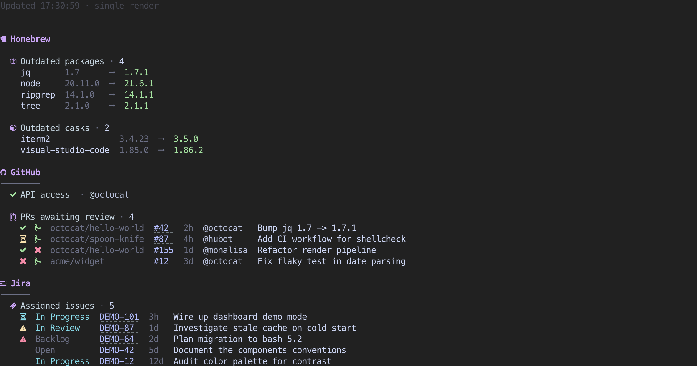

# cli-dashboard

Personal CLI dashboard. Bash. macOS + brew only. Refreshes itself.



## Install

```bash
brew install coreutils gh git jq ankitpokhrel/jira-cli/jira-cli
```

`requirements.sh` prints the exact command if anything is missing.

## Env vars

```bash
export GH_TOKEN="<github token>"
export JIRA_API_TOKEN="<atlassian api token>"
export JIRA_HOST="https://<your-org>.atlassian.net"
jira init   # one-time, writes ~/.config/.jira/.config.yml
```

## Run

Check out the latest release tag to make full use of the new version available feature — sitting on the tag keeps the in-dashboard version indicator discreet (running on `master` past a tag flags as outdated).

```bash
git clone https://github.com/JReko/cli-dashboard.git
cd cli-dashboard
git checkout "$(git tag --sort=-v:refname | head -n 1)"
./dashboard.sh
```

Upgrade: `git fetch --tags && git checkout "$(git tag --sort=-v:refname | head -n 1)"`.


## Configure

Defaults live in `config.sh`. For personal tweaks, create `config.local.sh`
next to it — it's gitignored and sourced last, so anything you set there
overrides the defaults without dirtying `git status`.

```bash
# config.local.sh
DASHBOARD_REFRESH_MINUTES=1
COMPONENT_JIRA=false
```

Toggles:

- `DASHBOARD_REFRESH_MINUTES` — refresh interval (`0` = render once, exit)
- `DASHBOARD_DEMO=true|false` — render mock payloads instead of hitting APIs
- `COMPONENT_<NAME>=true|false` — enable/disable a component
- `FEATURE_<COMPONENT>_<NAME>=true|false` — enable/disable a single feature

Honors `NO_COLOR=1` and `UI_NO_NERDFONT=1`.

## Version indicator

The status bar appends the running version (from `git describe --tags`) and
compares it to the latest GitHub release. On the latest tag it stays discreet;
when behind it shows `⚠ <current> → <latest>`. Toggle with
`COMPONENT_VERSION` / `FEATURE_VERSION_UPDATE_CHECK`.

## Layout

```
dashboard.sh          entry point + render loop
config.sh             toggles
requirements.sh       startup dep + env validation
lib/ui.sh             colors, icons, hyperlink + section helpers
lib/demo.sh           fake payloads used when DASHBOARD_DEMO=true
components/<name>/
  <name>.sh           orchestrator: sources features, exposes <name>_render
  <feature>.sh        one feature, one public <component>_<feature>_check fn
```

## Add a component

1. `mkdir components/<name>`
2. Create `components/<name>/<feature>.sh` — public fn `<name>_<feature>_check`
3. Create `components/<name>/<name>.sh` — sources feature(s), gates each with `config_enabled FEATURE_<NAME>_<FEATURE>`
4. Add `COMPONENT_<NAME>=true` and `FEATURE_<NAME>_<FEATURE>=true` to `config.sh`
5. Source the orchestrator from `dashboard.sh` and call `<name>_render` gated on `COMPONENT_<NAME>`
6. If new external CLI / env var: add to `requirements.sh`
7. Add a `demo_<name>_<feature>_payload` mock to `lib/demo.sh` and branch the feature on `config_enabled DASHBOARD_DEMO`
8. `shellcheck -x dashboard.sh config.sh requirements.sh lib/*.sh components/**/*.sh`
